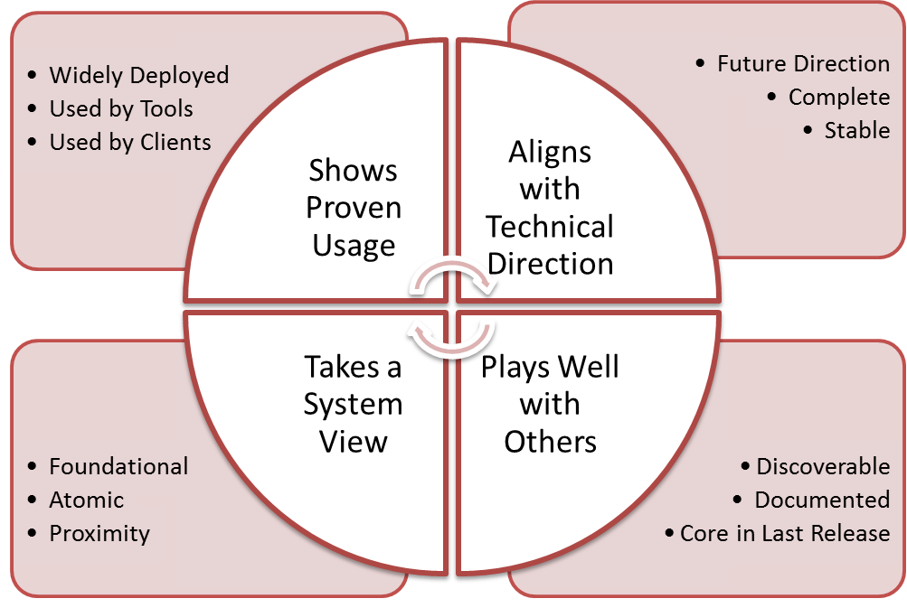

=============
Core Criteria
=============

.. contents::

General
=======

This is a subcomponent of the larger `Core Definition
<./CoreDefinition.rst>`_ documentation.

Core Capability Selection uses 12 criteria grouped into four primary
categories:

:Usage: the capability is widely used (Refstack will collect data)
:Direction: the capability advances OpenStack technically
:Community: the capability builds the OpenStack community experience
:System: the capability integrates with other parts of OpenStack

These categories summarize critical values that we want in OpenStack and so
make sense to be the primary factors used when we select DefCore capabilities.
While we strive to make the DefCore process objective and quantitive, we
must recognize that these choices drive community behavior.

   Graphic showing Capabilities Seleciton Criteria

Details
=======

With this perspective, here are the selection criteria.

    *To make cross reference easier, criteria are given a shortened name.*

SHOWS PROVEN USAGE
------------------

* **"Widely Deployed"** Candidates are widely deployed capabilities. We favor
  capabilities that are supported by multiple public cloud providers and
  private cloud products.

* **"Used by Tools"** Candidates are widely used capabilities:Should be
  included if supported by common tools (RightScale, Scalr, CloudForms,
  ...)

* **"Used by Clients"** Candidates are widely used capabilities: Should be
  included if part of common libraries (Fog, Apache jclouds, etc)

ALIGNS WITH TECHNICAL DIRECTION
-------------------------------

* **"Future Direction"** Should reflect future technical direction (from the
  project technical teams and the TC) and help manage deprecated
  capabilities.

* **"Stable"** Capabilities are required to be stable for >2 releases because
  we do not want DefCore capabilities that do not have dependable APIs.

* **"Complete"** Where the code being tested has a designated area of alternate
  implementation (extension framework) as per the DefCore Principles, there
  should be parity in capability tested across extension implementations.
  This also implies that the capability test is not configuration specific
  or locked to non-open technology.

PLAYS WELL WITH OTHERS
----------------------

* **"Discoverable"** Capability being tested is Service Discoverable (can be
  found in Keystone and via service introspection)

* **"Doc'd"** Should be well documented, particularly the expected behavior.
  This can be a very subjective measure and we expect to refine this
  definition over time.

* **"DefCore in Last Release"** A required capability should stay a required
  capability. This make makes DefCore capabilities sticky
  release per release. Leaving DefCore is disruptive to the ecosystem

TAKES A SYSTEM VIEW
-------------------

* **"Foundation"** Capabilities that are required by other required
  capabilities and/or depended on by many other capabilities

* **"Atomic"** Capability is unique and cannot be built out of other
  required capabilities

* **"Proximity"** (sometimes called a Capability Cluster) selects for
  capabilities that are related to DefCore capabilities. This helps ensure
  that related capabilities are managed together.

NON-ADMIN
---------

The original 13th "non-admin" criteria has been removed because Admin
APIs cannot be used for interoperability and are not considered DefCore.
